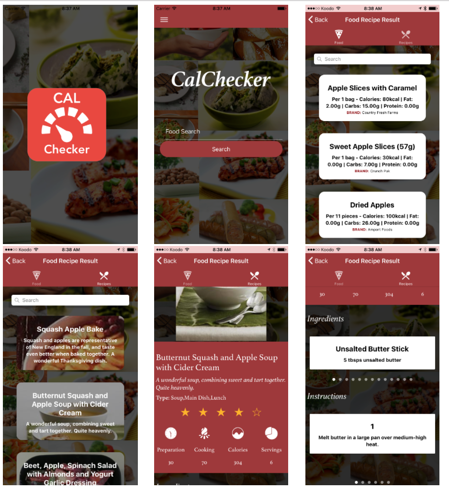

# Calorie Checker Application

## Table of Contents
- [Getting Started](#getting-started)
- [Setting up API Using Local Django](#setting)
  - [Local Deployment](#local)
  - [Heroku Deployment](#heroku)
- [Configuring](#configuring)
- [Deploying Application](#deploying)
  - [Prerequisites](#prerequisites)
  - [Progressive Web App](#progressive-web-app)
  - [Android](#android)
  - [iOS](#ios)
  - [Local Web](#web)
- [App Preview](#app-preview)


## Getting Started

## Setting up API Using Local Django
### Local Deployment
1. [Install Python](https://www.python.org/downloads/)

2. Install requirements
```bash
    cd api
    python -m pip install -r requirements.txt
```

3. Get Access and secret key from [FatSecret](https://platform.fatsecret.com/api/) and replace in `api/herokuapi/settings.py` line 138 and 139 

3. Start Django server
```bash
    python manage.py runserver
```

### Deploy on Heroku
[](https://heroku.com/deploy?template=https://github.com/Abiwax/CalorieCheckerIonic4)

## Configuring

Change main URL in `src/environments/environment.ts` under urls to django server link.

## Deploying Application

### Prerequisites
* [Download the installer](https://nodejs.org/) for Node.js 6 or greater.
* Install the ionic CLI globally: `npm install -g ionic`
* Clone this repository: `git clone https://github.com/ionic-team/ionic-conference-app.git`.
* Run `npm install` from the project root.
* Run `ionic serve` in a terminal from the project root.


_Note: See [How to Prevent Permissions Errors](https://docs.npmjs.com/getting-started/fixing-npm-permissions) if you are running into issues when trying to install packages globally._

### Progressive Web App

1. Un-comment [these lines](https://github.com/ionic-team/ionic2-app-base/blob/master/src/index.html#L21)
2. Run `npm run ionic:build --prod`
3. Push the `www` folder to your hosting service

### Android

1. Run `ionic cordova run android --prod`

### iOS

1. Run `ionic cordova run ios --prod`

### Local Web

1. Run `npm start` or `ionic serve` in a terminal from the project root.

## App Preview

